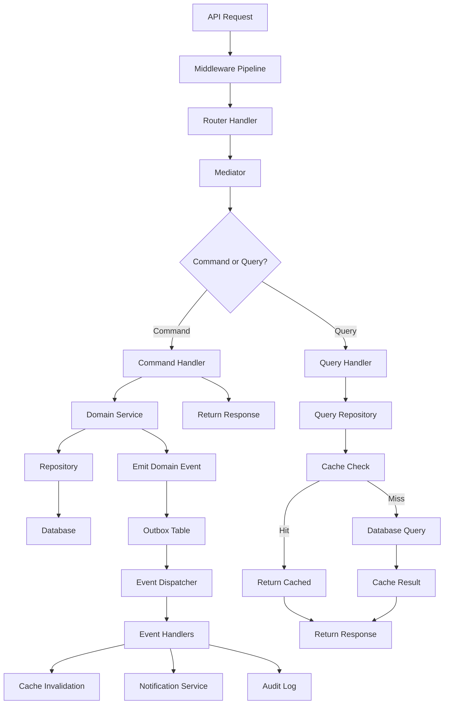

# Enterprise Task Management System - Architecture Design

## 0. Specification-Driven Development (SDD) Methodology

**Chosen Methodology:** **OpenSpec (OpenAPI/Swagger-First Design)**

**Rationale:**
- **Contract-First Development**: API contracts defined before implementation ensures clear interface boundaries and enables parallel frontend/backend development
- **Tool Ecosystem**: Excellent tooling support (Swagger UI, code generation, validation)
- **Industry Standard**: OpenAPI is the de facto standard for REST API documentation, widely adopted and understood
- **FastAPI Integration**: Native OpenAPI support in FastAPI framework allows seamless specification generation and validation
- **Living Documentation**: The API specification serves as both design document and interactive documentation
- **Validation**: Pydantic schemas act as executable specifications, ensuring runtime validation matches design

**SDD Artifacts Included:**
1. **API Specification**: Section 12 defines all API contracts with request/response schemas
2. **Domain Model Specification**: Section 5 details aggregates, entities, and value objects
3. **Event Flow Specification**: Section 7 provides Mermaid diagram showing event-driven architecture
4. **Feature Specifications**: Separate sections for Authentication (Section 12.1), Multi-tenancy (Section 8), and Task Management (Section 12.3)

**Implementation Approach:**
1. Define API contracts and schemas (Section 12-13)
2. Model domain aggregates and events (Section 5-6)
3. Design CQRS commands/queries (Section 4)
4. Implement handlers following specifications
5. Validate against OpenAPI schema

## 1. Tech Stack

- **Language:** Python 3.13
- **Framework:** FastAPI 0.115+
- **ORM:** SQLAlchemy 2.0 (async)
- **Database:** PostgreSQL 16
- **Cache:** Redis 7
- **Validation:** Pydantic v2
- **Auth:** python-jose (RS256), passlib (Argon2)
- **Migrations:** Alembic
- **Testing:** pytest, pytest-asyncio
- **Logging:** loguru (structured logging)
- **Container:** Docker + docker-compose

## 2. Architecture Pattern

**Modular Monolith** with clear bounded contexts:
- `auth` - Authentication, MFA, token management
- `tenant` - Multi-tenancy, organization hierarchy
- `task` - Task management, CQRS implementation
- `shared` - Cross-cutting concerns (events, caching, middleware)

## 3. Directory Structure

```bash
task_management/
├── docker-compose.yml
├── requirements.txt
├── alembic.ini
├── .env.example
├── README.md
├── ARCHITECTURE.md
├── app/
│   ├── __init__.py
│   ├── main.py
│   ├── config.py
│   ├── auth/
│   │   ├── commands.py
│   │   ├── queries.py
│   │   ├── handlers.py
│   │   ├── domain/
│   │   │   ├── models.py
│   │   │   └── events.py
│   │   ├── schemas.py
│   │   ├── repository.py
│   │   └── router.py
│   ├── tenant/
│   │   ├── domain/
│   │   │   └── models.py
│   │   ├── schemas.py
│   │   ├── repository.py
│   │   # Note: an HTTP router for tenant management (`app/tenant/router.py`) is not present in the repository; tenant endpoints in the architecture are planned or can be implemented as needed.
│   ├── task/
│   │   ├── commands.py
│   │   ├── queries.py
│   │   ├── handlers.py
│   │   ├── domain/
│   │   │   ├── models.py
│   │   │   ├── events.py
│   │   │   └── aggregates.py
│   │   ├── schemas.py
│   │   ├── repository.py
│   │   └── router.py
│   └── shared/
│       ├── cqrs/
│       │   ├── mediator.py
│       │   ├── command.py
│       │   └── query.py
│       ├── events/
│       │   ├── dispatcher.py
│       │   └── handler.py
│       ├── middleware/
│       │   ├── error_handler.py
│       │   ├── logging.py
│       │   ├── tenant_resolver.py
│       │   ├── auth.py
│       │   └── rate_limiter.py
│       ├── security/
│       │   ├── jwt.py
│       │   ├── password.py
│       │   └── authorization.py
│       ├── cache/
│       │   ├── redis_client.py
│       │   └── decorators.py
│       ├── database.py
│       ├── response.py
│       └── context.py
└── tests/
    ├── unit/
    ├── test_observability.py
    └── conftest.py
```

## 4. CQRS Design

**Commands** (write operations):
- `RegisterUserCommand`, `LoginCommand`, `RefreshTokenCommand`
- `CreateTaskCommand`, `UpdateTaskCommand`, `AssignTaskCommand`, `DeleteTaskCommand`
- `CreateTenantCommand`, `UpdateTenantSettingsCommand`

**Queries** (read operations):
- `GetUserByIdQuery`, `GetUserPermissionsQuery`
- `GetTaskByIdQuery`, `GetUserTasksQuery`, `GetDepartmentTasksQuery`, `GetTaskStatisticsQuery`
- `GetTenantByIdQuery`, `GetTenantHierarchyQuery`

**Handler Structure:**
- Each command/query has dedicated handler
- Handlers validate, execute domain logic, emit events
- Mediator dispatches commands/queries to handlers
- Pipeline: Validation → Authorization → Handler → Event Emission
- Query handlers use caching decorator for performance

**Mediator Pattern:**
```python
mediator.send(CreateTaskCommand(...)) → CreateTaskHandler → TaskCreatedEvent
mediator.query(GetTaskByIdQuery(...)) → GetTaskByIdQueryHandler → TaskDTO
```

## 5. Domain Model

**Aggregates:**
- `TenantAggregate`: Root entity managing tenant lifecycle, settings, subscription
- `UserAggregate`: Root entity managing user identity, roles, permissions, MFA
- `TaskAggregate`: Root entity with task lifecycle, assignment, status transitions

**Entities:**
- `Tenant`, `Department`, `Team`, `Project`
- `User` (fields: id, tenant_id, email, username, password_hash, roles, permissions, department_id, last_login_at, last_password_change_at, mfa_enabled, mfa_secret, is_active, email_verified)
- `RefreshToken`, `MFASecret`
- `Task`, `Comment`, `Attachment`, `AuditLogEntry`

**Value Objects:**
- `Email`, `Password`, `TenantId`, `UserId`, `TaskId`
- `Role` (enum), `Permission` (enum), `TaskStatus` (enum), `Priority` (enum)
- `SubscriptionPlan`, `TenantSettings`

**Relationships:**
- Tenant → Users (1:N), Tenant → Departments (1:N)
- Department → Teams (1:N), Team → Projects (1:N)
- Task → User (assigned_to), Task → User (created_by), Task → Comments (1:N)

## 6. Domain Events

- `UserRegistered`, `UserLoggedIn`, `PasswordChanged`, `MFAEnabled`
- `TenantCreated`, `TenantSettingsUpdated`, `TenantDeactivated`
- `TaskCreated`, `TaskUpdated`, `TaskAssigned`, `TaskStatusChanged`, `TaskCompleted`, `TaskDeleted`, `TaskCommentAdded`
- `PermissionsChanged`, `RoleAssigned`

**Event Structure:** `event_id`, `event_type`, `aggregate_id`, `tenant_id`, `payload`, `timestamp`, `version`

**Event Publishing:**
- **Local (Development)**: Outbox pattern with background worker polling outbox table
- **Production (Scalability)**: RabbitMQ or Redis Pub/Sub for event distribution across services
- **Event Versioning**: Version field in event structure; handlers check version for backward compatibility

## 7. Event Flow Diagram



## 8. Multi-Tenancy Strategy

**Tenant Resolution (in order of precedence):**

1. **Subdomain-based**: Extract tenant from request host (e.g., `tenant1.example.com` → `tenant1`)
   - Subdomain is looked up in database to get `tenant_id`
   - Results are cached in Redis for 5 minutes
   - Reserved subdomains (`www`, `api`, `app`, `admin`) are ignored
   
2. **Header-based**: `X-Tenant-Id` header with tenant UUID
   
3. **JWT claim**: `tenant_id` claim in JWT token (set during authentication middleware)

**Implementation Location:** `app/shared/middleware/tenant_resolver.py`

**Subdomain Resolution Flow:**
```python
# Extract subdomain from host header
host = request.headers.get("host")  # e.g., "tenant1.example.com:8000"
subdomain = extract_subdomain(host)  # "tenant1"

# Resolve to tenant_id
tenant_id = await resolve_tenant_from_subdomain(subdomain)
# 1. Check Redis cache: "tenant:subdomain:tenant1"
# 2. Fallback to database lookup via TenantRepository
# 3. Cache result for 5 minutes
```

**Data Isolation:**
- Shared database with `tenant_id` discriminator on all tables
- SQLAlchemy global filter: `session.query(Task).filter(Task.tenant_id == context.tenant_id)`
- Automatic `tenant_id` injection on INSERT via context

**Query Filters:**
```python
@event.listens_for(Session, "do_orm_execute")
def receive_do_orm_execute(orm_execute_state):
    if context.tenant_id:
        orm_execute_state.statement = statement.where(tenant_id == context.tenant_id)
```

**Tenant Context:** Request-scoped context via `ContextVar` containing `tenant_id`, `user_id`, `correlation_id`

**Cache Namespacing:** `tenant:{tenant_id}:user:{user_id}:permissions`

## 9. Authorization Strategy

**Role-Based (RBAC):**
- Roles: `SYSTEM_ADMIN`, `TENANT_ADMIN`, `DEPARTMENT_HEAD`, `PROJECT_MANAGER`, `TEAM_LEAD`, `MEMBER`, `GUEST`
- JWT contains `roles` array

**Permission-Based (Claims):**
- Permissions: `tasks.read`, `tasks.create`, `tasks.update`, `tasks.delete`, `tasks.assign`, `reports.view`, `users.manage`, `tenant.configure`
- JWT contains `permissions` array derived from roles

**Subscription-Based (Feature Access):**
- Tenant subscription plans control feature access: `BASIC`, `PROFESSIONAL`, `ENTERPRISE`
- Features gated by plan: advanced reports (PRO+), SSO integration (ENTERPRISE), bulk operations (PRO+)
- Middleware validates: `@require_subscription_feature("advanced_reports")`

**Resource-Based:**
```python
can_access_task(user, task):
    if user.role == TENANT_ADMIN: return True
    if task.assigned_to == user.id: return True
    if task.created_by == user.id: return True
    if user.department_id == task.project.department_id and "tasks.read" in user.permissions: return True
    return False
```

**Policy Decorators:**
```python
@require_permission("tasks.create")
@require_role(Role.MEMBER)
@require_resource_access(TaskAggregate)
```

## 9.1. Security Implementation Details

**Password Security:**
- **Minimum Length**: 12 characters (enforced via Pydantic validator)
- **Complexity Requirements**: At least 1 uppercase, 1 lowercase, 1 number, 1 special character
- **Compromised Password Check**: Integration with HaveIBeenPwned API (k-Anonymity model) to reject breached passwords
- **Hashing**: Argon2id with parameters: memory_cost=65536, time_cost=3, parallelism=4

**JWT Configuration:**
- **Algorithm**: RS256 (RSA asymmetric keys)
- **Access Token**: 15 minutes expiration
- **Refresh Token**: 7 days expiration
- **Required Claims**:
  - `sub`: user_id (UUID)
  - `email`: user email address
  - `tenant_id`: tenant identifier (UUID)
  - `roles`: array of role strings
  - `permissions`: array of permission strings
  - `department_id`: user's department (UUID, nullable)
  - `jti`: JWT ID (unique token identifier)
  - `iat`: issued at timestamp
  - `exp`: expiration timestamp

**Refresh Token Rotation:**
- Each refresh generates new access + refresh token pair
- Old refresh token is immediately revoked
- **Reuse Detection**: Track refresh token families; if revoked token is reused, revoke entire token family
- Implementation: `refresh_token` table tracks `token_hash`, `parent_token_id`, `is_revoked`, `family_id`

**Device Fingerprinting:**
- Capture: User-Agent, Accept-Language, screen resolution, timezone, canvas fingerprint
- Store fingerprint hash with refresh tokens
- Alert user on login from new device
- Optional: Require additional verification for unrecognized devices

**Security Headers (via middleware):**
```python
Strict-Transport-Security: max-age=31536000; includeSubDomains
Content-Security-Policy: default-src 'self'; script-src 'self'; object-src 'none'
X-Frame-Options: DENY
X-Content-Type-Options: nosniff
X-XSS-Protection: 1; mode=block
Referrer-Policy: strict-origin-when-cross-origin
Permissions-Policy: geolocation=(), microphone=(), camera=()
```

**XSS Prevention:**
- **Input Sanitization**: Bleach library for HTML input sanitization
- **Output Encoding**: Automatic escaping in FastAPI responses (JSON encoding)
- **Content-Type Enforcement**: Strict `application/json` content type validation
- **CSP Headers**: Restrict inline scripts and unsafe-eval

## 10. Caching Strategy

**Cache-Aside Pattern:**
- Check Redis → If hit, return → If miss, query DB → Store in Redis → Return

**Cached Data:**
- User permissions/roles: TTL 5 min, invalidate on role change
- Task lists: TTL 1 min, invalidate on task create/update/delete
- Tenant settings: TTL 10 min, invalidate on settings update

**Cache Keys:**
- `tenant:{id}:user:{id}:permissions`
- `tenant:{id}:tasks:list:{page}:{filters_hash}`
- `tenant:{id}:settings`

**Invalidation:** Domain event handlers trigger cache deletion

**Distributed Rate Limiting:** Redis sliding window, per-tenant and per-endpoint limits

## 11. Middleware / Request Pipeline Order

1. **ErrorHandlerMiddleware** - Global exception catching, structured error responses
2. **RequestLoggingMiddleware** - Log method, path, correlation_id, duration
3. **SecurityHeadersMiddleware** - Add HSTS, CSP, X-Frame-Options, X-Content-Type-Options
4. **TenantResolverMiddleware** - Extract tenant_id, validate, set context
5. **AuthenticationMiddleware** - JWT validation, set user context
6. **RateLimitMiddleware** - Redis-based rate limiting per tenant/endpoint
7. **ResponseCachingMiddleware** - HTTP cache headers (ETag, Last-Modified), conditional requests (If-None-Match)
8. **PerformanceMonitoringMiddleware** - Track response times, log slow queries (>1s), metrics collection
9. **CORSMiddleware** - Tenant-specific allowed origins from tenant settings, credentials support

## 12. API Specification

```python
# Auth Endpoints
POST   /api/v1/auth/register          → RegisterUserCommand
POST   /api/v1/auth/login             → LoginCommand
POST   /api/v1/auth/refresh           → RefreshTokenCommand
POST   /api/v1/auth/logout            → LogoutCommand
POST   /api/v1/auth/mfa/enable        → EnableMFACommand
POST   /api/v1/auth/mfa/verify        → VerifyMFACommand
POST   /api/v1/auth/password/reset-request  → RequestPasswordResetCommand
POST   /api/v1/auth/password/reset    → ResetPasswordCommand

# Tenant Endpoints
GET    /api/v1/tenants/{id}           → GetTenantByIdQuery
POST   /api/v1/tenants                → CreateTenantCommand
PUT    /api/v1/tenants/{id}           → UpdateTenantCommand

# Task Endpoints
GET    /api/v1/tasks                  → GetUserTasksQuery (paginated, filtered)
GET    /api/v1/tasks/{id}             → GetTaskByIdQuery
POST   /api/v1/tasks                  → CreateTaskCommand
PUT    /api/v1/tasks/{id}             → UpdateTaskCommand
DELETE /api/v1/tasks/{id}             → DeleteTaskCommand (soft delete)
PATCH  /api/v1/tasks/{id}/assign      → AssignTaskCommand
PATCH  /api/v1/tasks/{id}/status      → ChangeTaskStatusCommand
POST   /api/v1/tasks/{id}/comments    → AddTaskCommentCommand
GET    /api/v1/tasks/reports/statistics → GetTaskStatisticsQuery

# Health & Observability
GET    /health                        → Health check (DB, Redis, dependencies)
```

## 13. Data Model (Pydantic Schemas)

```python
# Auth Schemas
class RegisterUserRequest(BaseModel):
    email: EmailStr
    username: str
    password: str  # Min 12 chars, complexity validated, HaveIBeenPwned checked
    tenant_id: UUID

class LoginRequest(BaseModel):
    email: EmailStr
    password: str
    mfa_code: Optional[str] = None
    device_fingerprint: Optional[str] = None  # For device tracking

class TokenResponse(BaseModel):
    access_token: str
    refresh_token: str
    token_type: str = "Bearer"
    expires_in: int  # 900 seconds (15 min)

# Task Schemas
class CreateTaskRequest(BaseModel):
    title: str
    description: str
    project_id: UUID
    priority: Priority
    assigned_to_user_id: Optional[UUID] = None
    due_date: Optional[datetime] = None
    tags: List[str] = []
    estimated_hours: Optional[float] = None

class TaskResponse(BaseModel):
    id: UUID
    tenant_id: UUID
    project_id: UUID
    title: str
    description: str
    status: TaskStatus
    priority: Priority
    assigned_to_user_id: Optional[UUID]
    created_by_user_id: UUID
    watchers: List[UUID] = []
    tags: List[str] = []
    due_date: Optional[datetime]
    estimated_hours: Optional[float]
    actual_hours: Optional[float]
    created_at: datetime
    updated_at: datetime
    version: int  # For optimistic concurrency control

class TaskListResponse(BaseModel):
    items: List[TaskResponse]
    total: int
    page: int
    page_size: int

# Tenant Schemas
class TenantResponse(BaseModel):
    id: UUID
    name: str
    subdomain: str
    subscription_plan: str
    max_users: int
    is_active: bool
    settings: Dict[str, Any]  # JSON settings
    created_at: datetime
    updated_at: datetime
```

## 14. Observability Plan

**Structured Logging:**
- `loguru` with JSON formatter
- Context: `correlation_id`, `tenant_id`, `user_id`, `request_id`
- Log levels: INFO (requests), ERROR (exceptions), DEBUG (cache hits/misses)

**Metrics:**
- Request count, duration (p50, p95, p99), error rate
- Cache hit ratio, active connections
- Tasks created per tenant, active users

**Health Checks:**
- `/health`: Database connectivity, Redis connectivity, external services
- `/ready`: Application ready to serve traffic (Kubernetes readiness probe)
- `/live`: Application liveness check (Kubernetes liveness probe)

**Distributed Tracing (OpenTelemetry):**

The system implements full distributed tracing using OpenTelemetry, providing end-to-end visibility across all components:

**Components Instrumented:**
- FastAPI (HTTP requests, middleware)
- SQLAlchemy (database queries)
- Redis (cache operations)

**Configuration:**
```python
# Environment variables
OTLP_ENDPOINT=http://jaeger:4317  # OTLP gRPC endpoint (optional)
OTEL_SERVICE_NAME=task-management-system
OTEL_ENABLED=true
```

**Tracing Features:**
- Automatic span creation for HTTP requests
- Database query tracing with query text
- Cache operation tracing (get/set/delete)
- Manual span creation for business operations
- Context propagation across service boundaries (W3C Trace Context)
- Exception recording with stack traces

**Implementation Location:** `app/shared/observability/tracing.py`

**Usage Example:**
```python
from app.shared.observability.tracing import create_span, add_span_attributes

# Manual span for business logic
with create_span("process_task_assignment"):
    add_span_attributes(task_id=str(task.id), assignee=str(user.id))
    # ... business logic
```

**Correlation ID:** Generated per request, passed through all layers, logged in all entries, included in trace spans

## 14.1. API Response Format Standards

**Success Response:**
```json
{
  "success": true,
  "data": {
    // Response payload (object or array)
  },
  "metadata": {
    "pagination": {
      "page": 1,
      "page_size": 20,
      "total": 100
    },
    "timestamp": "2026-02-15T10:30:00Z"
  }
}
```

**Error Response:**
```json
{
  "success": false,
  "error": {
    "code": "TASK_NOT_FOUND",
    "message": "Task with ID abc-123 not found",
    "details": {}
  },
  "metadata": {
    "timestamp": "2026-02-15T10:30:00Z",
    "correlation_id": "xyz-789"
  }
}
```

## 15. Standards

- **PEP 8** compliance, `black` formatter
- **Full type hints** (mypy strict mode)
- **Async/await** for all I/O operations
- **Result pattern** for business logic errors (no exceptions for flow control)
- **Environment-based config** (12-factor app, `.env` files)
- **Database migrations** via Alembic with up/down scripts
- **Test coverage:** 70%+ for business logic, 100% for authorization
- **API versioning:** URL-based (`/api/v1/`)
- **Graceful shutdown:** Signal handlers for SIGTERM, cleanup connections

## 16. Task Status State Machine

**Valid Status Transitions:**
```
TODO → IN_PROGRESS → IN_REVIEW → DONE
TODO → BLOCKED
IN_PROGRESS → BLOCKED
BLOCKED → TODO | IN_PROGRESS
IN_REVIEW → IN_PROGRESS (revisions needed)
* → CANCELLED (admin only)
```

**Validation Rules:**
- Cannot transition DONE → any other status (immutable completion)
- BLOCKED requires `blocked_reason` in update payload
- IN_REVIEW requires `assigned_to_user_id` to be set
- Status changes emit `TaskStatusChanged` event for audit trail

