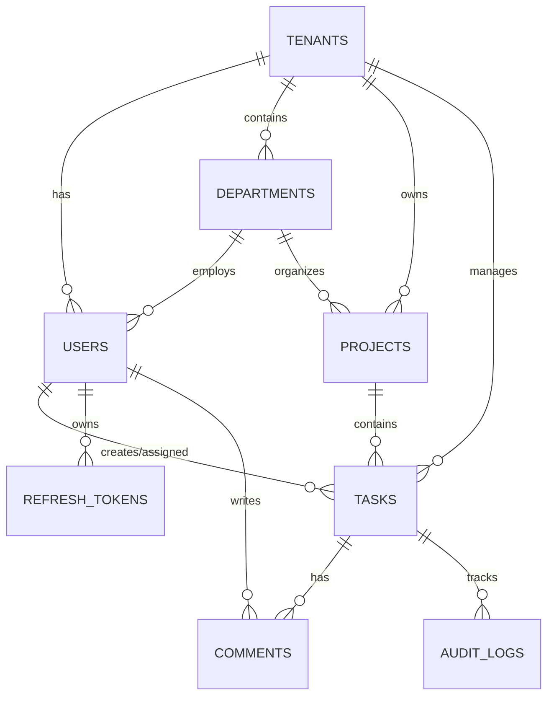

# Database Schema Documentation

## Overview
PostgreSQL 16 database with multi-tenant architecture using shared schema with `tenant_id` discriminator.

## Entity Relationship Diagram



## Core Tables

### Tenants
| Column | Type | Description |
|--------|------|-------------|
| id | UUID (PK) | Unique identifier |
| name | VARCHAR(255) | Organization name |
| subdomain | VARCHAR(100) UNIQUE | Tenant subdomain |
| subscription_plan | VARCHAR(50) | BASIC/PROFESSIONAL/ENTERPRISE |
| max_users | INTEGER | User limit |
| is_active | BOOLEAN | Active status |
| settings | JSONB | Flexible configuration |

**Indexes**: PK on `id`, UNIQUE on `subdomain`

---

### Users
| Column | Type | Description |
|--------|------|-------------|
| id | UUID (PK) | Unique identifier |
| tenant_id | UUID (FK) | Tenant reference |
| email | VARCHAR(255) | User email |
| username | VARCHAR(100) | Display name |
| password_hash | VARCHAR(255) | Argon2id hash |
| roles | ARRAY | RBAC roles |
| permissions | ARRAY | Permission strings |
| department_id | UUID (FK) | Department reference |
| mfa_enabled | BOOLEAN | MFA status |
| mfa_secret | VARCHAR(255) | TOTP secret |
| is_active | BOOLEAN | Account status |

**Indexes**: `(tenant_id, email)` UNIQUE, `tenant_id`, `department_id`

---

### Refresh Tokens
| Column | Type | Description |
|--------|------|-------------|
| id | UUID (PK) | Token identifier |
| user_id | UUID (FK) | User reference |
| tenant_id | UUID (FK) | Tenant reference |
| token_hash | VARCHAR(255) UNIQUE | SHA-256 hash |
| jti | VARCHAR(255) UNIQUE | JWT ID |
| parent_token_id | UUID (FK) | Previous token (rotation) |
| family_id | UUID | Token family (reuse detection) |
| is_revoked | BOOLEAN | Revocation status |
| expires_at | TIMESTAMP | Expiration time |

**Indexes**: `token_hash` UNIQUE, `jti` UNIQUE, `(user_id, tenant_id)`, `family_id`

---

### Tasks
| Column | Type | Description |
|--------|------|-------------|
| id | UUID (PK) | Task identifier |
| tenant_id | UUID (FK) | Tenant reference |
| project_id | UUID (FK) | Project reference |
| title | VARCHAR(500) | Task title |
| description | TEXT | Detailed description |
| status | ENUM | TODO/IN_PROGRESS/IN_REVIEW/BLOCKED/DONE/CANCELLED |
| priority | ENUM | LOW/MEDIUM/HIGH/CRITICAL |
| assigned_to_user_id | UUID (FK) | Assignee |
| created_by_user_id | UUID (FK) | Creator |
| watchers | ARRAY[UUID] | Watching users |
| tags | ARRAY[VARCHAR] | Search tags |
| due_date | TIMESTAMP | Deadline |
| version | INTEGER | Optimistic locking |
| is_deleted | BOOLEAN | Soft delete |

**Indexes**: `(tenant_id, project_id)`, `(tenant_id, assigned_to_user_id)`, `(tenant_id, status)`

**Status Transitions**: TODO → IN_PROGRESS → IN_REVIEW → DONE | BLOCKED ↔ TODO/IN_PROGRESS

---

### Comments
| Column | Type | Description |
|--------|------|-------------|
| id | UUID (PK) | Comment identifier |
| tenant_id | UUID (FK) | Tenant reference |
| task_id | UUID (FK) | Task reference |
| user_id | UUID (FK) | Author |
| content | TEXT | Comment text |

**Indexes**: `(tenant_id, task_id)`

---

### Audit Logs
| Column | Type | Description |
|--------|------|-------------|
| id | UUID (PK) | Log identifier |
| tenant_id | UUID (FK) | Tenant reference |
| task_id | UUID (FK) | Task reference |
| user_id | UUID (FK) | Actor |
| action | VARCHAR(100) | Action type |
| changes | JSONB | Before/after data |
| created_at | TIMESTAMP | Action time |

**Indexes**: `(tenant_id, task_id, created_at)`, `(tenant_id, created_at)`

---

## Multi-Tenancy Implementation

**Strategy**: Shared database, row-level isolation via `tenant_id`

**Query Filtering**: SQLAlchemy session filters automatically inject:
```python
session.query(Task).filter(Task.tenant_id == current_tenant_id)
```

**Cache Namespacing**: `tenant:{id}:resource:{type}:{id}`

---

## Performance Optimization

**Critical Indexes**:
```sql
CREATE INDEX idx_tasks_tenant_project ON tasks(tenant_id, project_id);
CREATE INDEX idx_tasks_tenant_assigned ON tasks(tenant_id, assigned_to_user_id);
CREATE INDEX idx_users_tenant_email ON users(tenant_id, email);
CREATE INDEX idx_audit_tenant_time ON audit_logs(tenant_id, created_at);
```

**Connection Pool**: 20 base connections, 10 overflow, 1-hour recycle

---

## Migration Commands

```bash
# Initialize Alembic
alembic init migrations

# Create migration
alembic revision --autogenerate -m "Description"

# Apply migrations
alembic upgrade head

# Rollback
alembic downgrade -1
```

