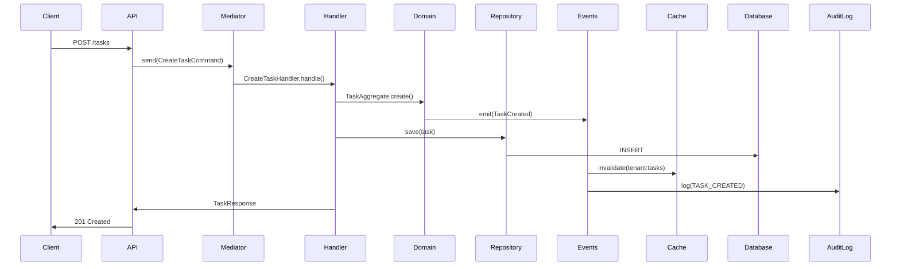
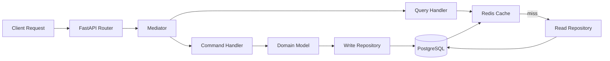
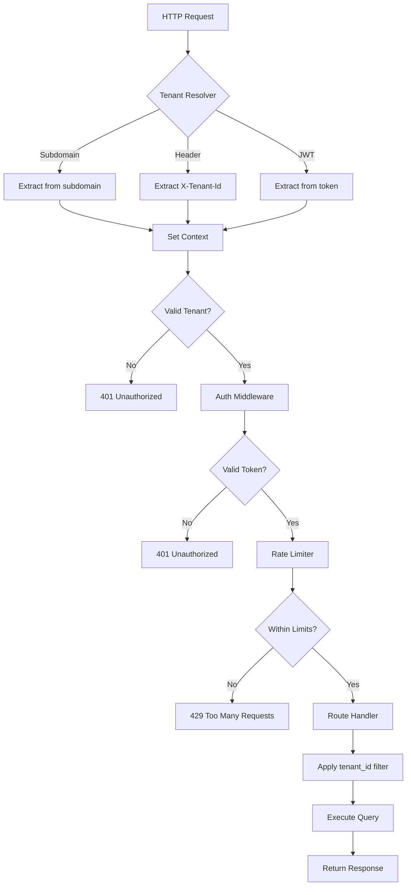
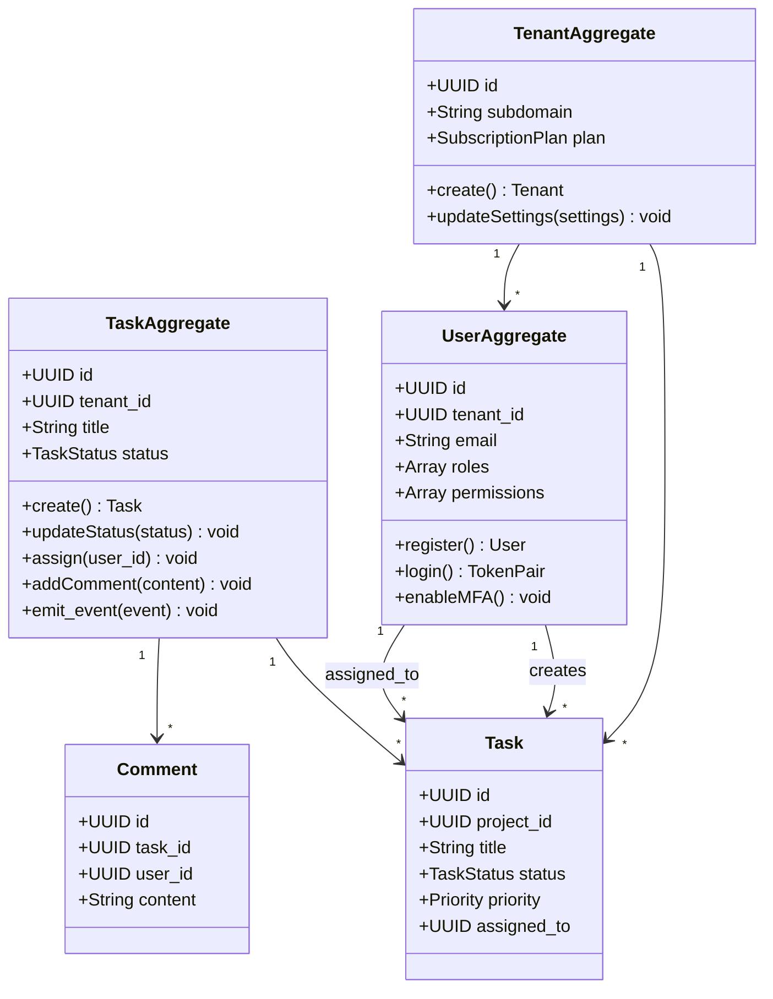
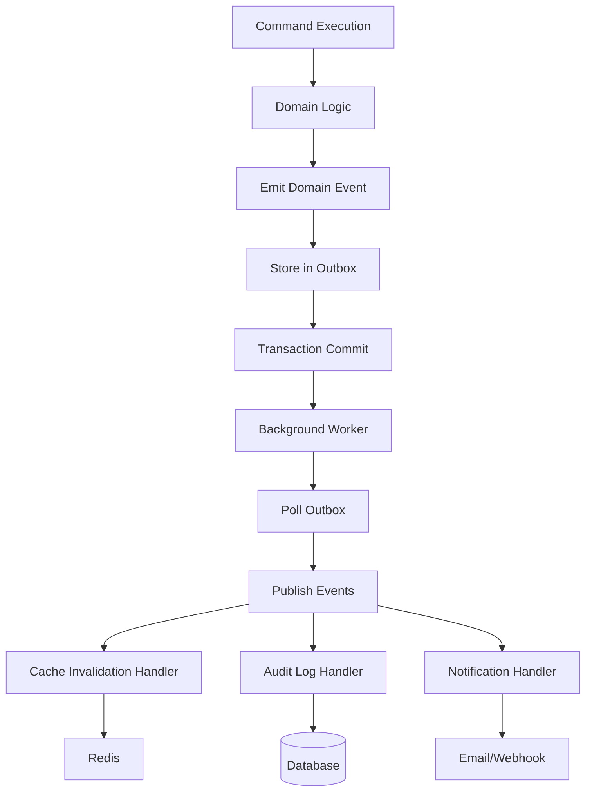
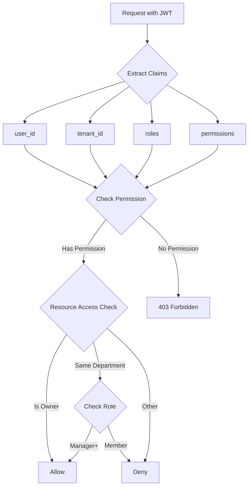

# Event Flow & Domain Model

## Event-Driven Architecture Flow

## CQRS Pattern

## Multi-Tenant Request Flow

## Domain Model Structure

## Event Publishing Pattern

## Authorization Flow

## Key Patterns Summary

### Aggregates
- **TenantAggregate**: Manages tenant lifecycle, settings, subscription
- **UserAggregate**: Handles authentication, authorization, profile
- **TaskAggregate**: Controls task lifecycle, status transitions, assignments

### Domain Events
- `TaskCreated`, `TaskUpdated`, `TaskStatusChanged`, `TaskAssigned`
- `UserRegistered`, `UserLoggedIn`, `PasswordChanged`, `MFAEnabled`
- `TenantCreated`, `TenantSettingsUpdated`

### Event Handlers
- **CacheInvalidationHandler**: Clears related cache entries
- **AuditLogHandler**: Records all changes for compliance
- **NotificationHandler**: Sends alerts (future feature)

### Repository Pattern
- Write operations through aggregate roots
- Read operations use optimized queries with caching
- Automatic tenant_id filtering at session level

**Notes / current repo status:**
- The architecture describes using an outbox pattern for reliable event delivery; the repo includes an event dispatcher and handlers but does not include a dedicated outbox table or background polling worker. Implementing the outbox table and worker is left as a TODO for cross-process delivery in production.
- Tenant domain models and repository code are implemented, but a tenant HTTP router (`app/tenant/router.py`) exposing tenant management endpoints is not present in the repository and can be added if needed.
